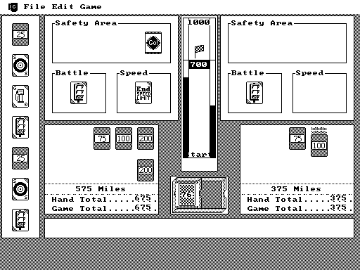
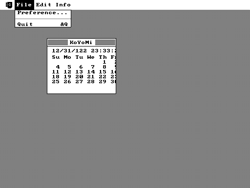
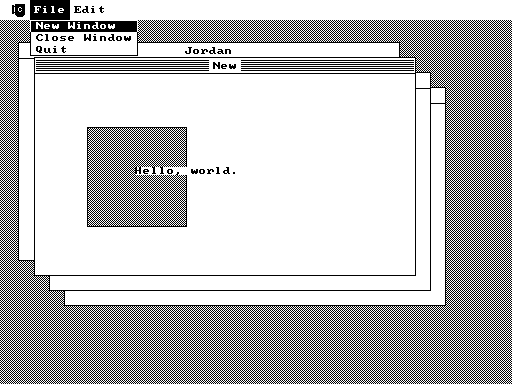

<div align="center">


</div>

# About

Cyder lets you run [Classic Mac OS](https://en.wikipedia.org/wiki/Classic_Mac_OS) applications on modern operating systems (like macOS and Linux) -- you can think of it as functionally equivalent to [WINE](https://www.winehq.org/) but for Classic Mas OS.

Cyder employs a form of [high-level emulation (HLE)](https://emulation.gametechwiki.com/index.php/High/Low_level_emulation). It uses the [Musashi](https://github.com/kstenerud/Musashi) Motorola 68k emulator to run original m68k binaries but all calls to the [Macintosh Toolbox](https://en.wikipedia.org/wiki/Macintosh_Toolbox) are intercepted and implemented in native code to run on the host. Cyder is currently targeting compatiblity with [Mac OS 6.0.8](https://en.wikipedia.org/wiki/Classic_Mac_OS#System_Software_6) but may target higher versions as time goes on.

A major goal of the project is to be easy to understand and learn from (it was started as a learning exercise by the author) and promote a better understanding of retro computers.

# Initial Setup

Ensure submodules are sync'd:

```console
git submodule update --init --recursive
```

**Dependencies**:
 + [SDL2](https://www.libsdl.org/)
 + [Python 3.8](https://www.python.org/downloads/release/python-380/)
 + [CMake 3.5](https://cmake.org/download/)
 + *Optionally [Ninja](https://ninja-build.org/)*

# Build and Run

<details><summary>Using cyder.py</summary>

> cyder.py uses [Ninja](https://ninja-build.org/) to build (allowing for faster incremental builds)


```console
# To build all targets
./cyder build

# To build the emulator
./cyder build emu

# To run the emulator
./cyder run emu <path_to_rsrc_fork>

# To build and run the emulator
./cyder bar emu <path_to_rsrc_fork>
```

</details>

<details><summary>Using Ninja</summary>

```console
mkdir -p build/out
cmake -GNinja -Bbuild/out

# Only this command is needed to build from now on
ninja -C build/out

# To run the emulator
./build/out/exe/emu <path_to_rsrc_fork>
```

</details>

<details><summary>Using Make</summary>

```console
mkdir build && cd build
cmake ..

# To build all targets
make

# To run the emulator
./build/exe/emu <path_to_rsrc_fork>
```

</details>

## Resource Forks

Mac OS applications are stored with two *forks*: 1) the data fork which stores unstructured data and 2) the resource fork which stores structured data (details such as icon bitmaps, the shapes of windows, definitions of menus and their contents, and **application code**). 

Unfortunately, modern filesystems do not understand the concept of *forks* and trying to copy a Mac OS application around will result in corrupted or missing data (the exception to this rule is modern macOS which has retained *partial* compatibility with HFS/HFS+ used on the classic Mac OS).

Cyder gets around these limitations by reading *raw* resource forks. These can be produced on Linux by finding or producing (from an emulator) a `.bin` ([MacBinary](https://en.wikipedia.org/wiki/MacBinary)) or `.hqx` ([BinHex](https://en.wikipedia.org/wiki/BinHex)) and then unpacking it into separate data and resource fork files using a tool like `./cyder bar macbinary <file.bin>` or `hexbin -f <file.hqx>`.

# Screenshots

<div align="center">



*[1000 Miles](https://www.macintoshrepository.org/2964-1000-miles): A clone of [Mille Bornes](https://en.wikipedia.org/wiki/Mille_Bornes) by Robert Harris (1987)*


*["Bill"](https://www.macintoshrepository.org/8239-bill): An Essential Background Application by Jeff Hokit (1987)*


*[Galaxy](https://www.macintoshrepository.org/9526-galaxy): Simple starfield at `examples/galaxy.rsrc`*



*"KoYoMi": Simple Calendar by V.J. Catkick (1986)*



*Window Demo: An example of window management at `examples/window.rsrc`*

</div>
